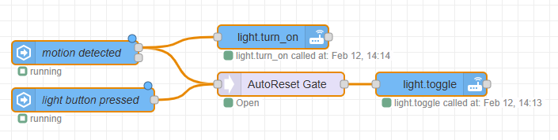
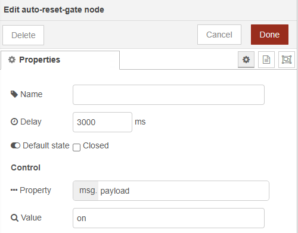
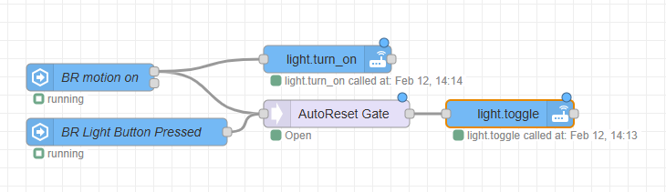

# node-red-contrib-auto-reset-gate

[](https://nodered.org) [](https://opensource.org/licenses/MIT)

A Node-RED node intended to address a specific kind of race condition. The node acts as a controllable gate for message flow, blocking or passing messages for a configurable duration.  The gate toggles when receiving a message matching the configured value.  

## Installation

Install via the Node-RED palette manager:

1.  Open the Node-RED menu (top-right hamburger icon).
2.  Select "Manage palette".
3.  Go to the "Install" tab.
4.  Search for `@kylehase/node-red-contrib-auto-reset-gate`.
5.  Click "Install".

Alternatively, install from the command line in your Node-RED user directory (typically `~/.node-red`):

```bash
npm install @kylehase/node-red-contrib-auto-reset-gate
```

## Usage

This node acts as a gate that can be either normally open (passing messages) or normally closed (blocking messages). The gate's state is controlled by a combination of a configurable default state, a message property value, and a reset delay.



### Input

Messages arriving at this input are either passed through to the output or blocked, depending on the gate's state.

### Control

The gate's state is toggled when a message arrives that meets the following condition:

*   The value of the configured `Message Property` in the incoming message (`msg.[Message Property]`) is strictly equal (using string comparison) to the configured `Match Value`.

If this condition is met, the gate's state is toggled (from open to closed, or closed to open, based on the `Default State`). After the configured `Delay`, the gate automatically returns to its `Default State`.

Control messages recevied during the delay will extend the delay.

### Output

If the gate is open, messages from the input are passed through to the output. If the gate is closed, messages are blocked and *not* sent to the output.

Control messages are not passed to output.

## Configuration



*   **Name:** (Optional) A descriptive name for the node, displayed in the flow editor.

*   **Delay:** (Required) The time, in milliseconds, before the gate automatically resets to its default state after being toggled. Must be a positive number.

*   **Default State:** (Required) Determines the initial and reset state of the gate.
    *   `Closed`: The gate starts closed (blocking messages). A matching message *opens* the gate temporarily.
    *   `Open`: The gate starts open (passing messages). A matching message *closes* the gate temporarily.

#### Control

*   **Property:** (Required) The property of the incoming message (`msg`) to check. Supports nested properties (e.g., `payload.command.activate`). Uses a standard Node-RED `typedInput` restricted to `msg` properties.

*   **Value:** (Required) The value that `msg.[Message Property]` must equal (as a string) to trigger the gate.

## Status Indicator

The node displays a status indicator below its icon in the flow editor:

*   **Green dot:** The gate is currently open (passing messages).
*   **Red dot:** The gate is currently closed (blocking messages).
*   **Text:** Displays either "Open" or "Closed" to indicate the current state.

## Example Flows

### Example 1: Prevent accidental power off

This flow demonstrates using the `auto-reset-gate` to fix a race condition where a user presses a light toggle button just after a motion detector turns on a light, preventing the user from turning the light off.

1.  **Button state node:** Attach to Auto-Reset-Gate.
1.  **Motion sensor node:** Attach to Auto-Reset-Gate and light_on node. (Control)
2.  **Auto-Reset Gate Node:**
    *   `Delay`: 3000 (3 seconds)
    *   `Default State`: Open (default)
    *   `Message Property`: msg.state
    *   `Match Value`: on
	* 	Attach to Light toggle node
4.  **Light_on Node:** Node that turns a light on when motion is detected
5.  **Light-Togle Node:** Node that toggles a light on/off when a button is pressed

The motion sensor will turn the light on and close the gate for 3s, blocking the button press message.


### Example 2: Prevent accidental power on

This flow demonstrates using the `auto-reset-gate` to fix a race condition where a user presses a light toggle button to turn a light off but the motion detector turns it back on.

1.  **Button state node:** Attach to Auto-Reset-Gate and Light-Toggle. (Control)
1.  **Motion sensor node:** Attach to Auto-Reset-Gate.
2.  **Auto-Reset Gate Node:**
    *   `Delay`: 5000 (5 seconds)
    *   `Default State`: Open (default)
    *   `Message Property`: msg.data.new_state.attributes.event_type
    *   `Match Value`: single
	* 	Attach to Light_on node
4.  **Light_on Node:** Node that turns a light on when motion is detected
5.  **Light-Togle Node:** Node that toggles a light on/off when a button is pressed

The user will press the button to turn the light off. If motion is detected just after the button press, it will not turn the light back on.



## License

This node is licensed under the MIT License. See the `LICENSE` file (if included) or the `package.json` for details.